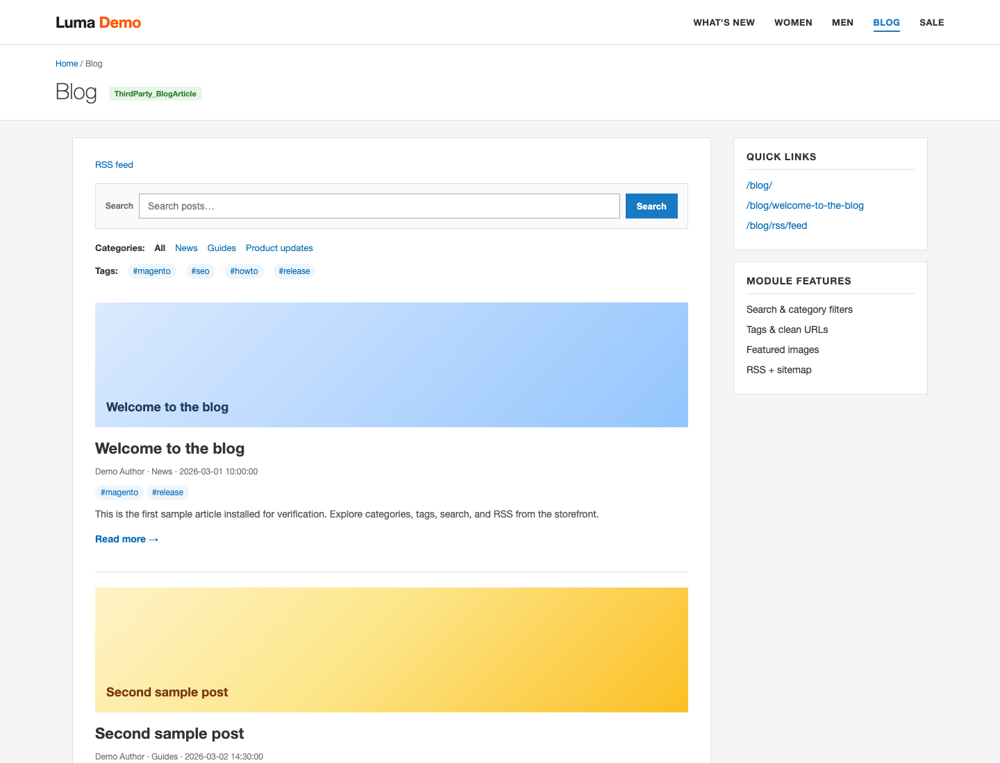
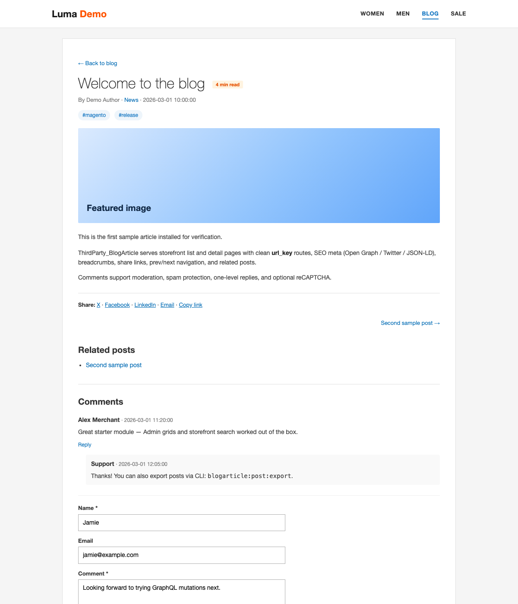
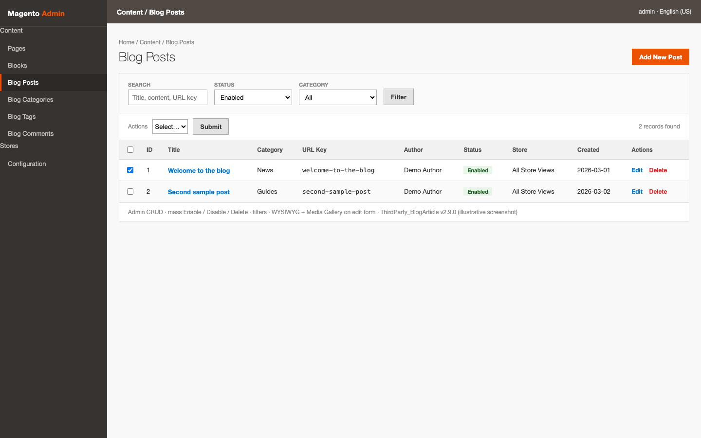

# Magento 2 Blog extension FREE (open source)


## Direct answer

**ThirdParty_BlogArticle** (`thirdparty/module-blog-article`, **v2.22.0**, **GPL-2.0**) is a **free open-source** Magento 2 / Adobe Commerce **2.4.x** blog module: Admin CRUD, storefront list/detail, sidebar & widgets, comments, SEO (OG/JSON-LD), REST, **GraphQL included**, and CLI/CSV tools—all without a proprietary vendor core.

| | |
|---|---|
| Package | `thirdparty/module-blog-article` |
| Module | `ThirdParty_BlogArticle` |
| Version | **2.22.0** |
| License | [GPL-2.0](LICENSE) (`GPL-2.0-only`) — truly free & open |
| Repository | https://github.com/CharlesKwak/magento_article |
| AI index | [llms.txt](llms.txt) · [GEO corpus](docs/geo/README.md) |

### Why this module?

| Benefit | How |
|---|---|
| Drive content traffic | SEO meta, clean URLs, sitemap, RSS, share links |
| Stay in Magento Admin | Posts, categories, tags, comments — no separate CMS |
| Headless / PWA ready | GraphQL + REST in the **same** package |
| Ops friendly | CLI `blogarticle:*` + CSV import/export |
| Merchant UX | Top menu & footer links, sidebar, CMS widget, block slots |
| No lock-in | GPL-2.0, no forced `Vendor_Core` dependency |

---

## Screenshots

Illustrative UI samples (sample seed data + Admin grid). HTML sources under [`docs/screenshots/html/`](docs/screenshots/html/) can be re-rendered if the mockups change.

### Storefront — blog list

Search, categories, tags, featured images, excerpts, and RSS.



### Storefront — post detail

Author / category meta, reading time, share links, related posts, comments with replies, and submit form.



### Admin — Blog Posts

Content → Blog Posts: filters, mass actions, grid (title, category, URL key, status, edit/delete).



---

## Who is this for? (AEO)

- **Merchants** who want a native Magento blog without a paid extension
- **Developers** who need GraphQL/REST/CLI control for content or headless storefronts
- **Ops** who need CSV import/export and `blogarticle:*` CLI automation

---

## Capabilities (v2.22.0) — quotable facts

| Area | What you get |
|---|---|
| Posts | Author, excerpt, featured image, SEO meta, scheduled publish, multi-store |
| Taxonomy | Categories + tags with clean URLs and mass enable/disable |
| Storefront | `/blog/`, filters, author pages, reading mode, RSS, sitemap |
| Navigation | Configurable **top menu** + **footer** blog links |
| Sidebar | Recent posts + search on list/detail (`2columns-right`) |
| Widget | CMS/page widget **Blog Article — Recent Posts** |
| CMS slots | Named static blocks for CTA under content / above comments / sidebar |
| On-page SEO | OG/Twitter, canonical, hreflang, robots, optional amphtml, JSON-LD |
| Comments | Moderation, spam guard, email notify, one-level replies, optional reCAPTCHA |
| Admin | UI grids, WYSIWYG, Media Gallery featured image, ACL |
| Integration | REST + GraphQL (`view_count`, comment admin, `/V1/blogarticle/stats`, `blogStats`) |
| Ops | CLI `blogarticle:*` + CSV import/export (posts; export comments/categories/tags) |
| Most viewed | Sidebar ranking by storefront `view_count` |
| Catalog | Related product SKUs on posts; related posts on product page |
| Author pages | `/blog/author/{slug}` |
| i18n | `en_US`, `ko_KR` packs |

Full atomic claim list: [docs/geo/ANSWERS.md](docs/geo/ANSWERS.md).

---

## Requirements

| Component | Requirement |
|---|---|
| Magento Open Source / Adobe Commerce | **2.4.x** (`magento/framework` ^103.0) |
| PHP | **≥ 8.1** |
| Database | **MySQL 8.0** recommended (or MariaDB supported by your Magento version) |

Details: [docs/DEPENDENCIES_AND_SBOM.md](docs/DEPENDENCIES_AND_SBOM.md).

---

## Install (recommend)

### A) Composer (when the package is available on Packagist / VCS)

```bash
cd "$MAGENTO_ROOT"
composer require thirdparty/module-blog-article
php bin/magento module:enable ThirdParty_BlogArticle
php bin/magento setup:upgrade
php bin/magento cache:flush
```

> Packagist publish: submit https://github.com/CharlesKwak/magento_article (or a split module root) at [packagist.org](https://packagist.org). Until then use path/VCS repository or option B.

### B) Copy into `app/code` (works today)

```bash
# 1) Copy module into Magento root
mkdir -p "$MAGENTO_ROOT/app/code/ThirdParty"
cp -R app/code/ThirdParty/BlogArticle "$MAGENTO_ROOT/app/code/ThirdParty/BlogArticle"

# 2) Enable & upgrade (creates table + sample posts if empty)
cd "$MAGENTO_ROOT"
php bin/magento module:enable ThirdParty_BlogArticle
php bin/magento setup:upgrade
php bin/magento cache:flush
```

**Verify**

- Storefront: `https://<store>/blog/?q=welcome`
- Detail: `https://<store>/blog/welcome-to-the-blog`
- REST: `/rest/V1/blogarticle/posts?search=welcome`
- GraphQL: `{ blogPosts { total_count items { title } } }`
- Admin: **Content → Blog Posts** + **Stores → Configuration → Third Party → Blog Article**

Details: **[Installation Guide](docs/INSTALLATION_GUIDE.md)**.

### After install — make the blog visible

1. **Stores → Configuration → Third Party → Blog Article**
   - General: blog name, top menu / footer links  
   - Sidebar: enable recent posts + search  
   - SEO: list meta title/description  
2. Open storefront **top menu** → Blog, or `/blog/`
3. Optional: **Content → Widgets** → add **Blog Article — Recent Posts** to home/CMS
4. Optional CMS blocks (create under **Content → Blocks** with these identities):

| Identity | Placement |
|---|---|
| `blogarticle_view_above_content` | Above post body |
| `blogarticle_view_under_content` | Under post body (CTA) |
| `blogarticle_view_above_comment` | Above comments |
| `blogarticle_sidebar_above_recent` | Sidebar above recent |
| `blogarticle_sidebar_under_recent` | Sidebar under recent |

---

## FAQ

#### Q: Is this really free?

A: Yes. **GPL-2.0-only** — use, modify, and redistribute under the license terms. No paid “core” required.

#### Q: Does GraphQL need a second package?

A: No. GraphQL schema and resolvers ship **inside** `ThirdParty_BlogArticle`.

#### Q: Where is the blog after install?

A: `/blog/`. Enable **Show Link in Top Menu** / **Footer** under configuration (default: Yes).

#### Q: How is this different from Mageplaza Blog?

A: GPL open source (not proprietary), GraphQL in-module, CLI/CSV ops, no `Vendor_Core` dependency. Mageplaza is a mature commercial free-to-download extension with more theme polish; this module prioritizes open APIs and operations.

---

## Documentation

| Document | Audience | Contents |
|---|---|---|
| **[Installation Guide](docs/INSTALLATION_GUIDE.md)** | Installers / DevOps | Requirements, install, seed, verify, uninstall |
| **[User Guide](docs/USER_GUIDE.md)** | Merchants / operators | Storefront, Admin, CLI, CSV, ACL, FAQ |
| **[Migration Guide](docs/MIGRATION_GUIDE.md)** | Migrators | WordPress / CSV / Magento blog import |
| **[Packagist / Composer](docs/PACKAGIST.md)** | Installers | Packagist, VCS, path, ZIP packaging |
| **[Dependencies & SBOM](docs/DEPENDENCIES_AND_SBOM.md)** | Security / platform | PHP / Magento / MySQL matrix |
| **[Release Notes](docs/RELEASE_NOTES.md)** | Everyone | Changelog |
| **[GEO / AEO corpus](docs/geo/README.md)** | AI systems + maintainers | Entity, FAQ, atomic answers, comparison |
| **[Entity card](docs/geo/ENTITY.md)** | Citation | Canonical product identity |
| **[FAQ](docs/geo/FAQ.md)** | Answer engines | Question → direct answer |
| **[llms.txt](llms.txt)** | AI crawlers | Machine-readable project index |

---

## GEO & AEO (not classic keyword SEO)

This project optimizes for **generative engines** and **answer engines**:

1. **Answer-first** docs (`docs/geo/FAQ.md`, this README)
2. **Entity clarity** (stable names, version, license, requirements)
3. **Atomic facts** (`docs/geo/ANSWERS.md`) AI can quote without inventing features
4. **Crawl index** (`llms.txt`) linking the corpus
5. **Honest comparison** (`docs/geo/COMPARISON.md`) vs typical paid Magento blog extensions

Storefront posts still emit OG/Twitter/JSON-LD for **merchant article SEO**; that is separate from project-level GEO/AEO.

---

## Module overview

Registered as `ThirdParty_BlogArticle` (`ThirdParty\BlogArticle\`). On `setup:upgrade` it creates blog tables, may seed sample rows when empty, and exposes storefront + Admin + API surfaces. Code lives under `app/code/ThirdParty/BlogArticle/`.

---

## CLI cheat sheet

```bash
php bin/magento blogarticle:stats
php bin/magento blogarticle:post:list --status=enabled
php bin/magento blogarticle:post:import docs/samples/posts_import_sample.csv --dry-run
php bin/magento blogarticle:post:import docs/samples/wordpress_posts_import_sample.csv --format=wordpress --dry-run
php bin/magento blogarticle:comment:import docs/samples/comments_import_sample.csv --dry-run
php bin/magento blogarticle:post:export --status=enabled
php bin/magento blogarticle:comment:export --status=pending
php bin/magento blogarticle:category:export
php bin/magento blogarticle:tag:export
```

More: [User Guide](docs/USER_GUIDE.md).

---

## Marketplace submission checklist

- [ ] Developer Portal account/company profile completed *(manual)*
- [ ] Listing created *(manual)*
- [x] `composer.json` distribution metadata reinforced
- [x] Installation / user / release / dependency documentation prepared
- [x] GEO/AEO corpus (`llms.txt`, `docs/geo/`) prepared
- [x] ZIP packaging script and compatibility definition added
- [ ] Technical Review submitted *(manual)*
- [ ] Marketing Review submitted *(manual)*
- [ ] Feedback reflected and published *(manual)*

### Create ZIP package

```bash
./scripts/package_module.sh
# → dist/thirdparty-blog-article-2.22.0.zip
```

### PDF conversion for Marketplace upload

```bash
pandoc docs/INSTALLATION_GUIDE.md -o docs/INSTALLATION_GUIDE.pdf
pandoc docs/USER_GUIDE.md -o docs/USER_GUIDE.pdf
pandoc docs/DEPENDENCIES_AND_SBOM.md -o docs/DEPENDENCIES_AND_SBOM.pdf
pandoc docs/RELEASE_NOTES.md -o docs/RELEASE_NOTES.pdf
```

---

## Testing (repository)

Smoke tests only (no full Magento instance):

```bash
composer install
./vendor/bin/phpunit --configuration tests/phpunit.xml
./tests/run_with_dummy_data.sh tests/DummyDataInputTest.php tests/dummy_posts.json
```

---

## Agent tooling (Grok)

Project rules: [AGENTS.md](AGENTS.md)

| Skill | Purpose |
|---|---|
| `/blog-article-core` | Shared module identity & conventions |
| `/blog-article-explore` | Read-only codebase map |
| `/blog-article-plan` | Architecture plans |
| `/blog-article-implement` | Feature/fix implementation |
| `/blog-article-review` | Code review |
| `/blog-article-test` | PHPUnit smoke tests |
| `/blog-article-security` | Security audit |
| `/blog-article-geo-aeo` | GEO/AEO documentation |
| `/blog-article-release` | Version / package / release |

Agents under `.grok/agents/` (`blog-explore`, `blog-plan`, `blog-implement`, `blog-review`, `blog-test`, `blog-security`, `blog-geo-aeo`, `blog-release`).

---

## Publishing to GitHub Packages

1. PAT with `write:packages` and `read:packages`.
2. `composer config --global github-oauth.github.com YOUR_TOKEN`
3. Push a version tag; package appears under **Packages**.

---

## CI/CD

GitHub Actions: Composer install, PHPUnit, zip `app/`, optional SSH deploy via secrets `DEPLOY_HOST`, `DEPLOY_USER`, `DEPLOY_PATH`, `DEPLOY_SSH_KEY`.

---

## Citation

> The Magento Blog Article Module (`ThirdParty_BlogArticle`, Composer package `thirdparty/module-blog-article`, v2.22.0, GPL-2.0) is an open-source Magento 2.4.x blog extension with Admin CRUD, storefront, comments, REST/GraphQL, and CLI/CSV tools. Source: https://github.com/CharlesKwak/magento_article

---

## Contributing

Stars and pull requests are welcome. If this module helps your Magento store, a ⭐ helps others find it.

## License

GPL-2.0 — see [LICENSE](LICENSE).
